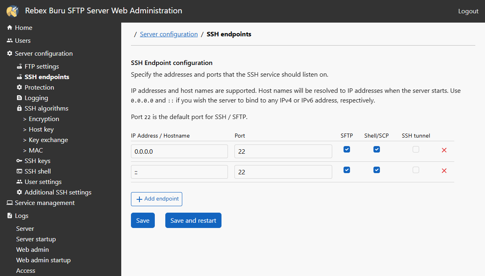
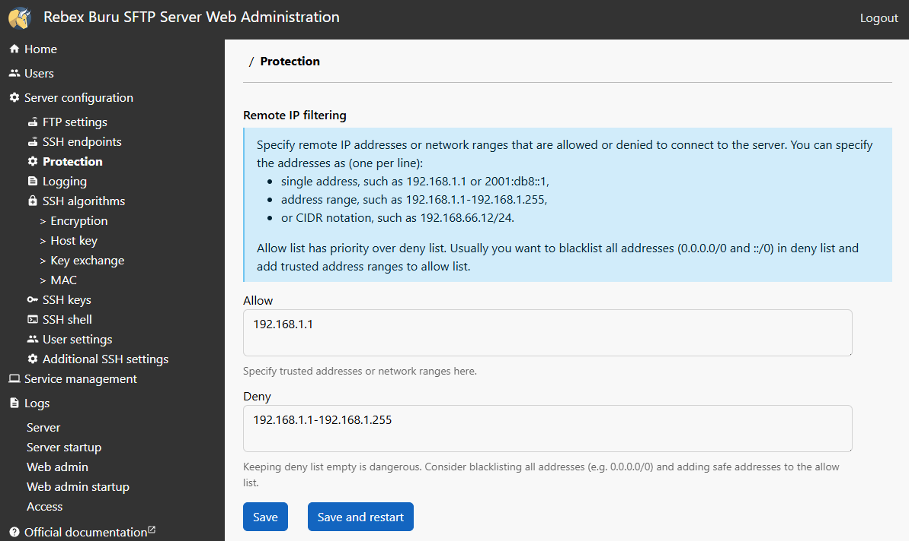
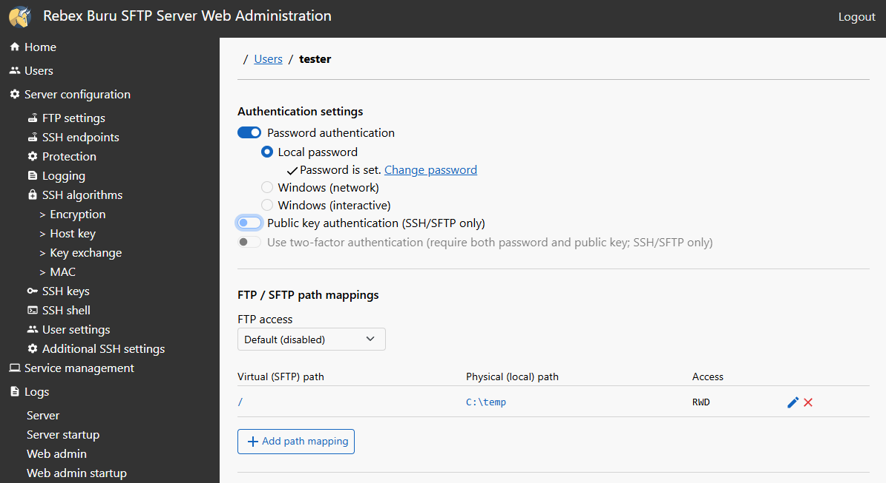
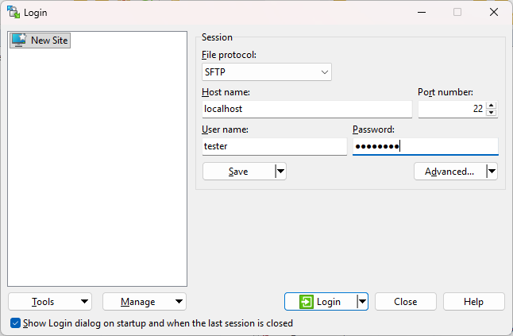
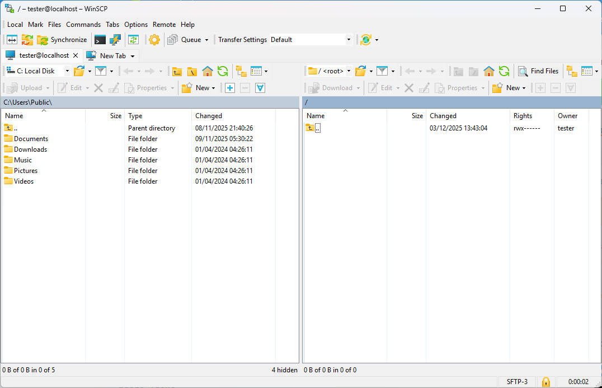

This guide explains how to transfer your configuration from the Tiny SFTP Server to the Buru SFTP Server.

Because the Tiny SFTP Server uses a simple XML configuration file, no automated export tool is available. You must manually retrieve your settings from the configuration file and apply them to the Buru version using the Web Administration dashboard.

## Prerequisites

To perform the migration, you need the following:

* Access to the `RebexTinySftpServer.exe.config` file. This is located in the same folder as the Tiny SFTP executable.
* The [Buru SFTP Server installer](https://www.rebex.net/buru-sftp-server/download/).
* Administrative privileges to install the Buru SFTP Server as a Windows Service.

<Steps>
  <Step title="Retrieve current settings">
    Before installing the new server, you need to extract your current configuration values from the Tiny SFTP Server configuration file.

    1.  Navigate to the folder containing your Tiny SFTP Server application.
    2.  Open the file `RebexTinySftpServer.exe.config` in a text editor (such as Notepad or VS Code). Below is an example of the configuration file:

    ```xml RebexTinySftpServer.exe.config
    <?xml version="1.0" encoding="utf-8"?>
    <configuration>
      <appSettings>
        <add key="userName" value="tester" />
        <add key="userPassword" value="password" />
        <add key="userRootDir" value="data" />
        <add key="sshPort" value="22" />
        <add key="sshIPBindings" value="" />
        <add key="userPublicKeyDir" value="" />
        </appSettings>
      <startup>
        <supportedRuntime version="v4.0" sku=".NETFramework,Version=v4.0" />
      </startup>
    </configuration>
    ```

    3.  Locate the `<appSettings>` section.
    4.  Record the values for the following keys:
        * `userName`: Your current username.
        * `userPassword`: Your current password (stored in clear text).
        * `userRootDir`: The path to the folder you are sharing.
        * `sshPort`: The port the server listens on (default is 22).
        * `userPublicKeyDir`: The folder containing public keys (if used).

    <Note>
      **Note on Host Keys**

      The keys `rsaPrivateKeyFile` and `dssPrivateKeyFile` define your server's identity. Buru SFTP Server will generate new, secure host keys during installation. If your clients rely on strict host key verification (fingerprinting), you will need to accept the new server key in your SFTP client upon the first connection.
    </Note>

  </Step>
  <Step title="Install Buru SFTP Server">
    The most efficient way to migrate your primary user is to recreate them directly during the installation process.

    1.  Run the **Buru SFTP Server** installer.
    2.  During the installation process, accept the License Agreement and select the destination location.
    3.  To finish the installation, click **Install**.

    <div
      style={{
        position: "relative",
        boxSizing: "content-box",
        width: "100%",
        aspectRatio: "1.27",
      }}
    >
      <iframe
        src="https://app.supademo.com/embed/cmiqb3yr504jfzh0ihrf17zi7?embed_v=2&utm_source=embed"
        loading="lazy"
        title="Installation Buru"
        allow="clipboard-write"
        frameBorder="0"
        allowFullScreen
        style={{
          position: "absolute",
          top: 0,
          left: 0,
          width: "100%",
          height: "100%"
        }}
      />
    </div>

    <Note>
      For additional guidance on the Buru SFTP Server installation, you can check the [official documentation](https://www.rebex.net/doc/buru-sftp-server/getting-started/01-installation/).
    </Note>

    After completing the installation, the Buru SFTP Server configuration wizard will open.
  </Step>
  <Step title="Configure the Buru SFTP Server">
    When the Buru SFTP Server configuration wizard opens, you can start the configuration, add the primary user, and migrate the configurations used in the Tiny SFTP Server:

    1.  Select the server edition and click **Next**. You can use the **Trial** edition for this migration.
    2.  For "Register SSH/SFTP server as a Windows service," use the default options and click **Next**.
    3.  For the **SSH/SFTP endpoint configuration**, you can use the default settings. If your Tiny SFTP Server configuration used a custom `sshPort` (other than 22), you can configure it here or update it later in the Web Administration.
    4.  Enable **Web Administration** to activate the browser-based dashboard. We recommend enabling it and configuring the **Username** and **Password**.
    5.  For the Web Administration, use the default settings and click **Next**. It will be available at `http://localhost:8880`.
    6.  You will reach the **Add user** step. Use the values you retrieved from the config file in Step 1 to configure the user:
        1.  **Username**: Enter the value found in the `userName` key.
        2.  **Password**: Enter the value found in the `userPassword` key.
        3.  **SFTP Root directory**: Enter the path found in the `userRootDir` key.
        4.  Click **Next**.

        <Tip>
          If you need to migrate multiple users, add the primary administrator during installation. You can add additional users later using the Web Administration interface.
        </Tip>

    7.  Buru SFTP Server will start all services. If all services receive an **OK** status, click **Next**.
    8.  The installation is complete. Click **Finish** to close the wizard. You can now access the **Web Administration** dashboard (`http://localhost:8880/`) and log in with the credentials you just created.

     <div
      style={{
        position: "relative",
        boxSizing: "content-box",
        width: "100%",
        aspectRatio: "1.27",
      }}
    >
        <iframe 
        src="https://app.supademo.com/embed/cmiqbs7nt04jwzh0ifw7i1rms?embed_v=2&utm_source=embed"
        loading="lazy"
        title="Installation Buru"
        allow="clipboard-write"
        frameBorder="0"
        allowFullScreen
        style={{
          position: "absolute",
          top: 0,
          left: 0,
          width: "100%",
          height: "100%"
        }}
      />
    </div>

  </Step>
  <Step title="Configure Advanced Settings (Optional)">
    If your `RebexTinySftpServer.exe.config` file contained advanced settings like public keys or custom IP bindings, or if you need to add new users, you can configure them now using the Web Administration.

    1.  Open the **Web Administration** dashboard (`http://localhost:8880/`).
    2.  Log in with the credentials you just created.

    <Note>
      If you used the default settings for the Tiny SFTP Server and configured the user during the installation, the username is `tester` and the password is `password`.
    </Note>

    <Steps>
      <Step title="Network Bindings (Ports and IPs)">
        If your Tiny SFTP server configuration used a custom `sshPort` or specific `sshIPBindings`, you must update the SSH endpoints in Buru to match.

        1.  In the left sidebar, locate the **Server configuration** section and click **SSH endpoints**.
        2.  Identify the active endpoint (default is `0.0.0.0` on port `22`).
        3.  Change the **Port** to match the `sshPort` value from your Tiny SFTP server configuration.
        4.  If your Tiny SFTP server configuration restricted connections to a specific IP (via `sshIPBindings`), enter that IP in the **Address** field (replacing `0.0.0.0`).
        5.  Click **Save**.

        

        <Note>
          If you need to specify more endpoints, click **Add endpoint**.
        </Note>
      </Step>
      <Step title="Logging">
        One of the main benefits of migrating to Buru SFTP Server is the ability to keep detailed logs. To configure it:

        1.  In the left sidebar, under **Server configuration**, click **Logging**.
        2.  Set the directories to save the logs:
            * **Server log**: Configure the directory path where general server logs will be stored.
            * **Access log**: Configure the directory path specifically for tracking user access and file operations.
        3.  Select the detail level for the logs from the **Minimum log level** dropdown menu.
        4.  Set the **Keep at most** size limit to manage disk usage (default is 0, which keeps files forever). You can click "keep all files" to reset this.
        5.  Click **Save**.
      </Step>
      <Step title="IP Access Control">
        If you require higher security restrictions regarding who can connect:

        1.  In the left sidebar, click **Protection**.
        2.  You can explicitly **Allow** or **Deny** specific IP addresses or CIDR ranges to control access to the server.
        3.  Click **Save**.

        
      </Step>
      <Step title="User Permissions and Public Keys">
        To refine user access rights or enable public keys:

        1.  Click **Users** in the sidebar.
        2.  Click on the **Username** you migrated (e.g., "tester").
        3.  To update user permissions, under the **SFTP / SFTP path mappings** section, click the pencil icon and update the access rights to grant specific permissions like Read, Write, or Delete.
        4.  To update authentication, under **Authentication settings**, enable **Public key authentication**. Then, add the **public key file** and the **public key** if you intend to use SSH keys.

        
      </Step>
    </Steps>
  </Step>
  <Step title="Verify the Connection">
    To ensure the migration was successful, connect to the Buru SFTP Server using an SFTP client.

    1.  Ensure the Tiny server is closed to avoid port conflicts (especially if both use port 22).
    2.  Open your preferred SFTP client. Check the [documentation](https://www.rebex.net/doc/buru-sftp-server/getting-started/03-connect/) to explore available options.
    3.  Enter the **Hostname** (e.g., `localhost`).
    4.  Enter the **Port number** (use the value from `sshPort`, or 22 if you used the default value).
    5.  Enter the **Username** and **Password**.

        

    6.  Connect and verify that you can access the files from your mapped root directory.

        
  </Step> 
</Steps>
